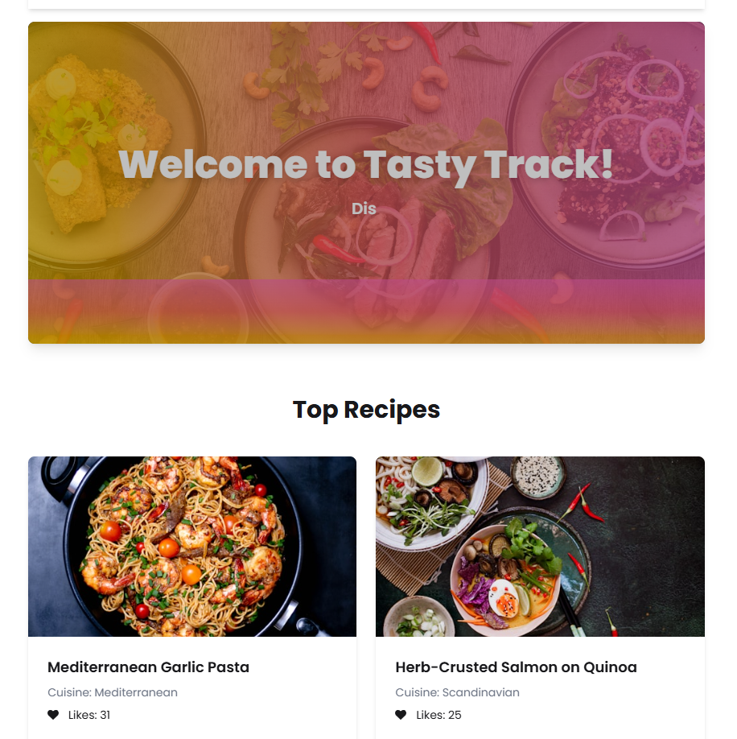

# 🥘 Tasty Track App

A full-stack Recipe Book application where users can explore, add, and manage their favorite recipes. Built with **React**, **Vite**, **Tailwind CSS**, **DaisyUI**, **Firebase Authentication**, **Express.js**, and **MongoDB**.

## 📸 Tasty Track

[Visit Site - Tasty Track](https://tastytrack-soyeb.netlify.app/)

## 

## ✨ Features

- 🔐 Firebase Authentication (Login & Register)
- 🧑 Protected Routes with Auth Context
- 🍲 Add, View, Edit, and Delete Recipes
- ❤️ Like Recipes (with like count)
- 🌟 Top Recipes Section (based on likes)
- 📜 Wishlist for favorited recipes
- 🎨 Modern UI with Tailwind CSS & DaisyUI
- 🧙‍♀️ Smooth animations with `react-awesome-reveal`
- 🍽️ Responsive design for all devices

---

## 🧑‍💻 Tech Stack

**Frontend**:

- React + Vite
- Tailwind CSS + DaisyUI
- React Router v7
- Firebase Auth
- SweetAlert2
- React Awesome Reveal

**Backend**:

- Node.js + Express.js
- MongoDB (No Mongoose)

---

## 🔧 Installation & Setup

### 📁 Clone the repository

```bash
git clone https://github.com/your-username/recipe-book-app.git
cd recipe-book-app
```
